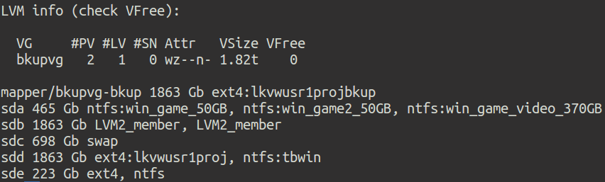

drivelayout.py
==============

Detailed listing of all drives on machine.

* Includes LVM volumes
* Will temporarily mount unmounted drives to show content
* Concise summary

Usage
-----

    Usage: drivelayout.py [options]
    
    Options:
      -h, --help   show this help message and exit
      --ls         list one line of files from unmounted devices
      --details    don't include summary information at end
      --summary    show only summary information
      --mount-all  leave all unmounted drives mounted for inspection
      --color      use color output even when redirected

Screenshots
-----------

Details

Summary

